# Project 1: Rasterizer
<center>

</center>
## 前言
第一个project的内容覆盖CS184从spring2019第一课到第五课的内容，包含了三角形光栅化
绘制，基本的矩阵变换和采样。总共是两个Section，七个part，由于第七个part属于个人自由
发挥选做内容。。本人由于懒没有做，因此只有前六个part。Project1采用了CS184教学团队
自己开发的GUI和图形库CGL，貌似是在OpenGL上封装了一层。详细的初始化说明请参考[README.md](./README.md)

## Section I: Rasterization

### Part 1: Rasterizing single-color triangles
#### 介绍
第一部分是光栅化三角形。这貌似是每个图形学入门课程开始必做的一个练习。
在开始之前，建议先看一下这篇文章，讲述了[图片如何以数据形式存在于计算机中](https://cs184.eecs.berkeley.edu/sp19/article/7/images-as-data)。<br>
本题的目标是给定每个像素点，判断是否在三角形之内，如果是则将传入的颜色赋值给该像素点。
只需要修改两个函数。
（1）`SampleBuffer::fill_color` in `drawrend.h`

（2）`DrawRend::rasterize_triangle` in `drawrend.cpp` 

#### 实现
其中 `SampleBuffer::fill_color` 函数用来填充一个sub-pixel的颜色，如下所示。
解释一下其中的几个变量。
- Intuitively, a sample buffer instance is a pixel,
- or (samples_per_side x samples_per_side) sub-pixels.
根据注释一个`SampleBuffer`代表一个采样区域（一开始是一个pixel）。后面这个采样区域会
变成由多个sub-pixel组成。sub_pixels[i][j]表明第i行第j个sub-pixel，对于本题来说
i和j一直是0（因为只有一个像素）。这个函数的修改很简单，将sub_pixels数组代表的sub-pixel填充好给定的颜色即可。

但是要注意PixelColorStorage，其声明如下，这个数组中每个元素表示三通道RGB中一个通道的颜色值，每个元素值大小在0-255。
```C++
typedef std::vector<unsigned char> PixelColorStorage;
```
从其初始化可以看出来，这是一个长度为3的数组，白色就是*(255, 255, 255)*。
```c++
PixelColorStorage white = std::vector<unsigned char>(3, 255);
```

`SampleBuffer` 还有两个数据成员，即sub_pixels和表示sub-pixel边长的samples_per_side。
```c++
    //sub_pixel的集合，一个三维向量，本质上是一个二维区域，每个sub_pixel有三通道
    std::vector<std::vector<PixelColorStorage> > sub_pixels;
    //这个就是sub-pixel的边长
    size_t samples_per_side;
```
我们要补完的`fill_color`函数如下。在图片初始化解析的过程中，颜色值被全部而Color中r，g，b三个值都是float并且限制在`[0,1]`的大小，因此我们需要先乘上255在做一个类型转换。否则图片就会是全黑的。
```c++
    void SampleBuffer::fill_color(int i, int j, Color c) {
      PixelColorStorage &p = sub_pixels[i][j];
      // Part 1: Overwrite PixelColorStorage p using Color c.
      //         Pay attention to different data types.
      if(p.size() != 3)
      {
        std::cout<<"PixelColorStorage没有初始化！"<<endl;
      }
      else
      {
        p[0] = (uint8_t)(c.r * 255);
        p[1] = (uint8_t)(c.g * 255);
        p[2] = (uint8_t)(c.b * 255);
      }
    }
```

然后就是我们的重头戏了，`DrawRend::rasterize_triangle` 函数，这个绘制三角形的函数将会贯穿整个project。首先我们来看函数的参数，*x0,y0,x1,y1,x2,y2*分别是三角形的三个顶点。*color*则是指定的颜色。每个要显示到屏幕上的三角形都会调用一次这个函数，在该函数中使该三角形内的像素点显示成指定的*color*。
```c++
 // Part 1: Fill in this function with basic triangle rasterization code.
 //         Hint: Implement fill_color() function first so that you can see
 //         rasterized points and lines, then start rasterizing triangles.
 //         Use something like this:
 //             samplebuffer[row][column].fill_pixel(color);
void DrawRend::rasterize_triangle( float x0, float y0,
                         float x1, float y1,
                         float x2, float y2,
                         Color color, Triangle *tri) {
```
核心是判断点是否位于三角形之内，我的做法是分别取x坐标和y坐标的最大最小值，形成三角形的外接长方形，然后对于这个长方形内的每个点进行逐步的判断，如果位于三角形之内就赋值相应的颜色，否则什么都不做（默认是白色）。这里是存在很大的优化空间的，但是我由于懒暂时没有做。。。。

三角形内部判定方程如下，值得注意的是，传入的点是没有默认的顺序的，可能是顺时针也可能是逆时针。
由于我们的判定方法是 **每个像素点对应的向量** 与 **每条边的法向量叉乘**，如果全部大于等于零（即sin夹角小于等于90°，此时法向量应该是朝向三角形内部）表示在三角形之内，但实际上换一个顺序（即法向量指向三角形之外）,此时只有当叉乘结果全部小于等于零才是在三角形之内的。

示意图如下。<br>
<center>
    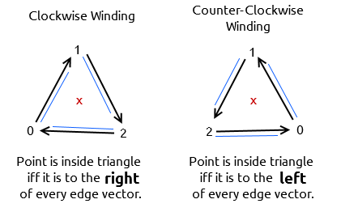
</center><br>

如果没有考虑到顺逆时针的问题，运行出来的结果就会像下图这样。
<center>
    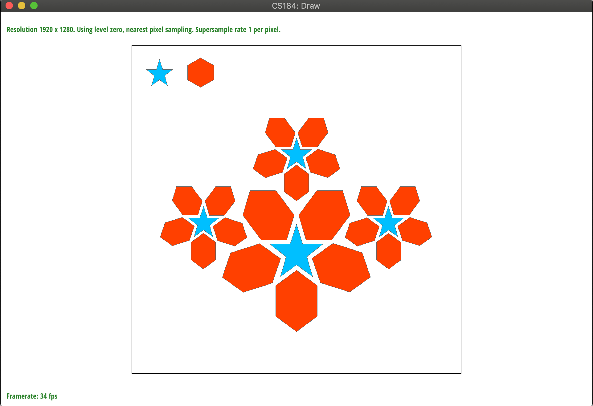
</center><br>

三角形内部判定公式如下<br>
<center>
    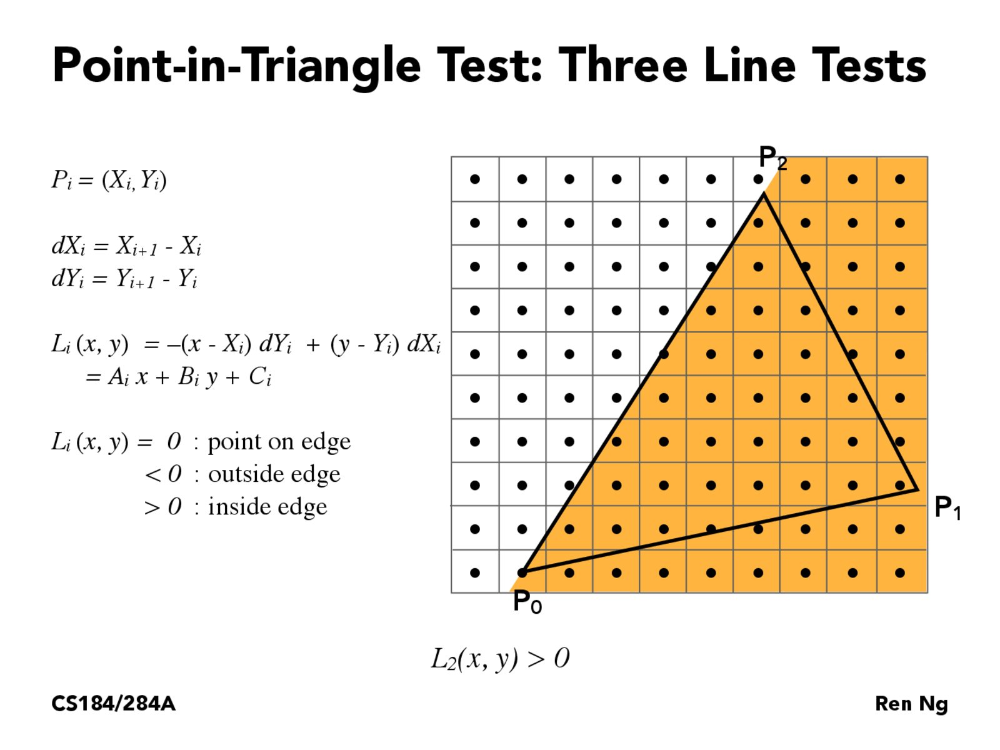
</center>>
<center>
    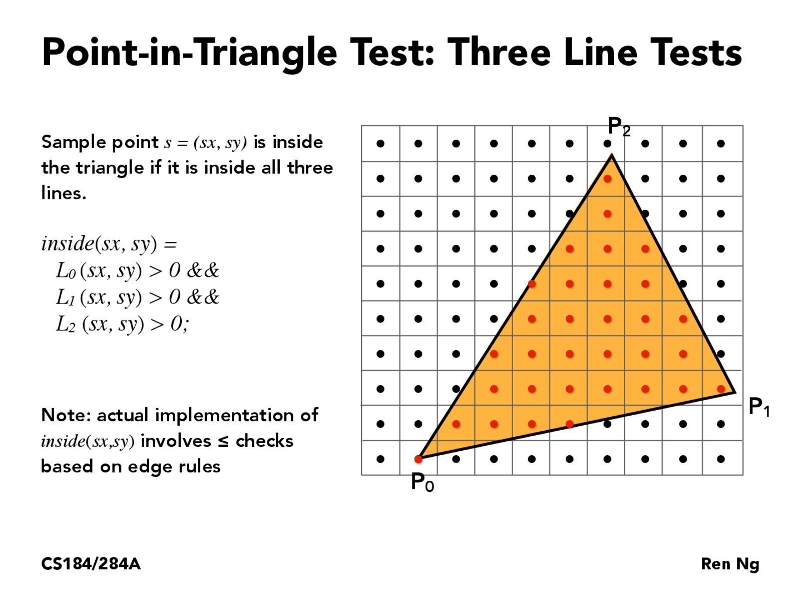
</center><br>
完整的实现如下。
```c++
void DrawRend::rasterize_triangle( float x0, float y0,
                         float x1, float y1,
                         float x2, float y2,
                         Color color, Triangle *tri) {  
  //照着我现在的理解，samplebuffer应该是整个屏幕
  //注意给定的三个点是顺时针顺序还是逆时针顺序是不定的！！！！因此不能假设为某一种顺序
  //(1)为了加速采样，把遍历区域改成一个长方形
  //
  float xMax = std::max(x0, x1);
  xMax = std::max(xMax, x2);
  float yMax = std::max(y0, y1);
  yMax = std::max(yMax, y2);
  float xMin = std::min(x0, x1);
  xMin = std::min(xMin, x2);
  float yMin = std::min(y0, y1);
  yMin = std::min(yMin, y2);

  float dx_10 = x1 - x0;
  float dx_21 = x2 - x1;
  float dx_02 = x0 - x2;
  float dy_10 = y1 - y0;
  float dy_21 = y2 - y1;
  float dy_02 = y0 - y2;

  for (int x = (int)xMin; x < (int)xMax; x++)
  {
      for (int y = (int)yMin; y < (int)yMax; y++)
      {
          float xCenter = x + 0.5f;
          float yCenter = y + 0.5f;
          int isInside = 0;
          //对于每个遍历范围内的点进行检测，检测是否在三角形之内
          //理论上只要三边都大于零或者都小于零就是在三角形之内
          //应为根据计算公式，我们假定法向量是顺时针或者逆时针的
          //但是根据P0 P1 P2三点的顺逆时针顺序，会使得得到的sin值全正或者全负（点在三角形之内）

          if (-dy_10 * (xCenter - x0) + dx_10 * (yCenter - y0) >= 0)
              isInside++;
          if (-dy_21 * (xCenter - x1) + dx_21 * (yCenter - y1) >= 0)
              isInside++;
          if (-dy_02 * (xCenter - x2) + dx_02 * (yCenter - y2) >= 0)
              isInside++;

          if (isInside == 0 || isInside == 3)
          {
              int xInt = x;
              int yInt = y;
              //行和列不要弄混了
              if (yInt >= 0 && yInt < samplebuffer.size() && xInt >= 0 && xInt < samplebuffer[yInt].size())
                  samplebuffer[yInt][xInt].fill_pixel(color);
          }
      }
  }
}
```
编译之后在`cmake-build-debug`文件下于命令行输入`./draw ../svg/basic` 就可以看到结果。
如果看到下图这样的结果那么就恭喜你，第一题完成啦！<br>
<div align="center">
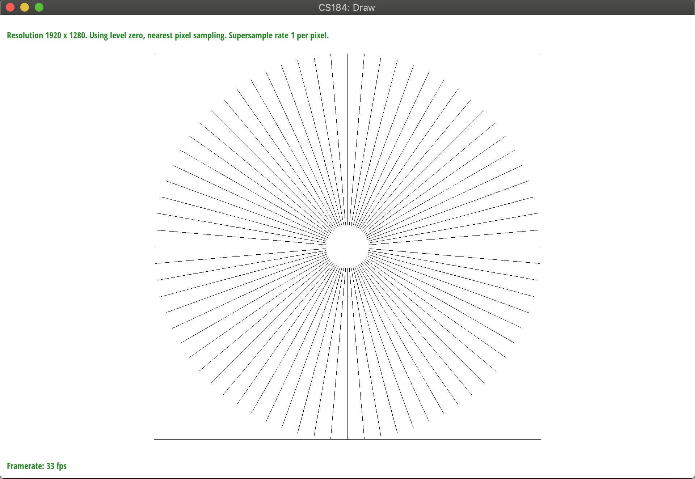
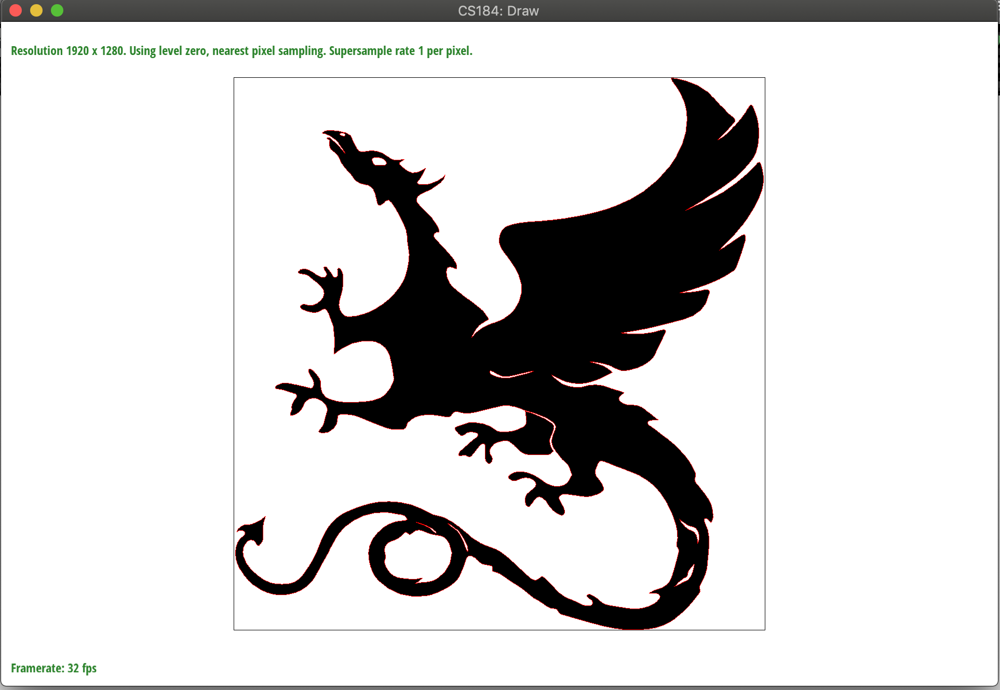
</div>

<br>
### Part 2: Antialiasing triangles
#### 介绍
第二部分让我们实现反走样（antialiasing），至于走样为什么会产生，由于没有学过信号处理对于这部分比较模糊，我只知道大概是由于临近像素点颜色差比较大的地方体现出来就是高频的部分，而如果图像的频率高于奈奎斯特频率（也就是采样频率的一半），就会出现图形彼此交叠失真的现象，下图展示了走样（混叠）和采用反走样后的图片。<br>
<div align="center">
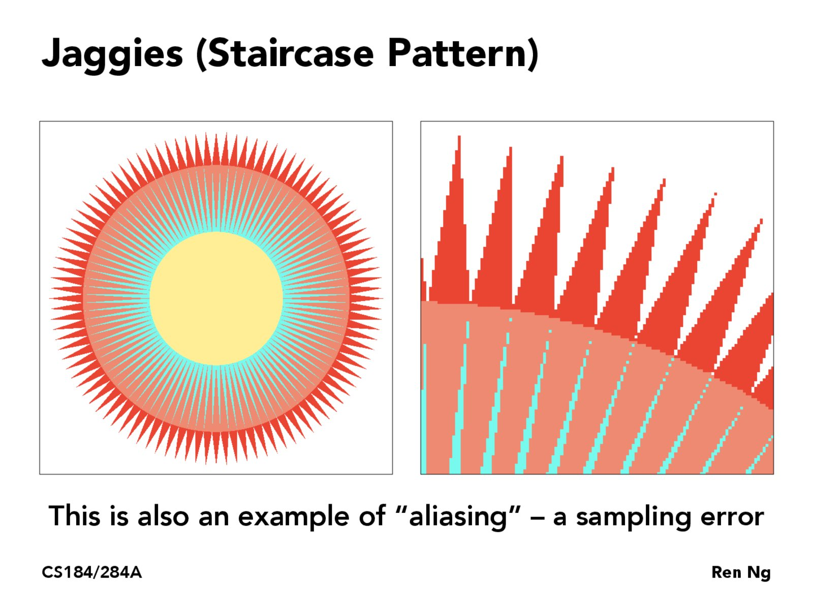
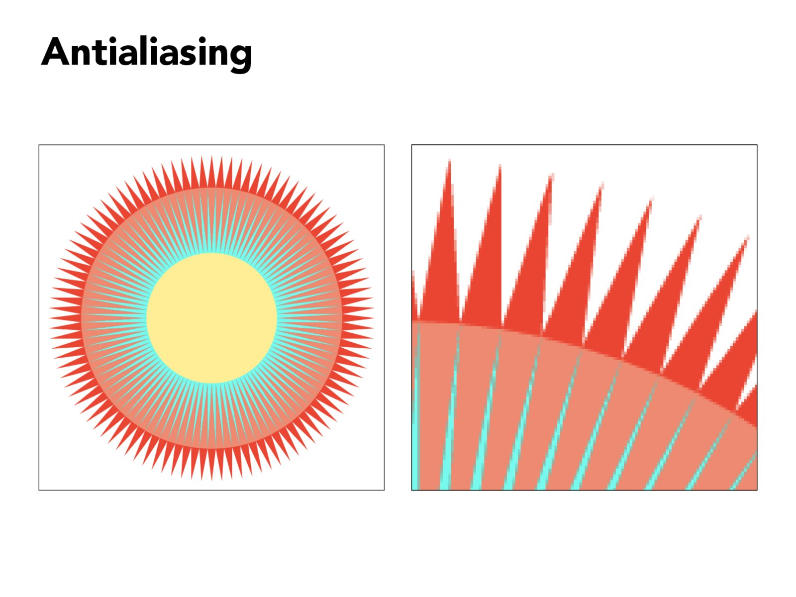
</div><br>
具体的理论我也不清楚，可以参考下[知乎上更详尽的一种解释](https://zhuanlan.zhihu.com/p/28800047)。<br>
回到我们的题目上来，我们要实现反走样，最最基本的方法就是super-sampling，字义上来看是超采样，wiki上翻译成反锯齿，如上图所示也很直观。就是我们将采样点增大，比方说一个像素分成四个子像素sub-pixel，然后对每个子像素采样，最后取一个平均值赋值给该像素。这样整个图形就会变得柔和一些，锯齿会减少。

#### 实现
本题中我们将每个像素分成`samples_per_side * samples_per_side`个子像素，其中`samples_per_side`就是边长。
<center>
    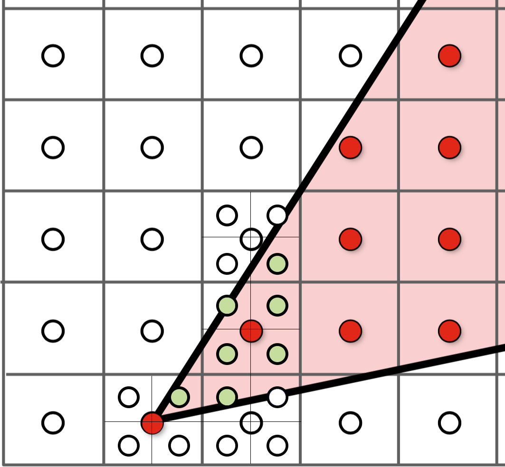
</center><br>
需要修改以下两个函数
（1）`DrawRend::rasterize_triangle` <br>
（2）`SampleBuffer::get_pixel_color` in `drawrend.h` <br>

其中`get_pixel_color`返回一个像素的平均颜色。代码如下
```c++

    Color get_pixel_color() {
      //vector::data 是第一个元素的地址      
      // Part 2: Implement get_pixel_color() for supersampling.
      // 需要返回平均颜色
      if(samples_per_side == 1)
          return Color(sub_pixels[0][0].data());

      Color arrangeColor = Color();
      for(int i = 0; i < samples_per_side; i++)
      {
        for(int j = 0; j < samples_per_side; j++)
        {
            try
            {
                PixelColorStorage &p = sub_pixels[i][j];
                //这里注意要转型
                arrangeColor += Color((float)p[0] / 255, (float)p[1] / 255, (float)p[2] / 255);
            }
            catch (int x)
            {
                std::cout<<"sub_pixels的长度与samples_per_side不相等！"<<std::endl;
            }

        }
      }

      arrangeColor.r /= samples_per_side * samples_per_side;
      arrangeColor.g /= samples_per_side * samples_per_side;
      arrangeColor.b /= samples_per_side * samples_per_side;
      return arrangeColor;
    }
```
<br>
而在渲染三角形的`DrawRend::rasterize_triangle`函数中，我们同样需要做一些修改。核心就是我添加了两个循环，遍历像素内的每个子像素，对子像素进行三角形内部判定，然后调用`fill_color`函数填充每个子像素sub-pixel的颜色而不是像上一题那样直接调用`fill_pixel`填充满整个像素。
你可能会问，那我们刚才实现的`get_pixel_color`用来干嘛呢？请参照project文档说明，里面说`get_pixel_color`会在绘制完之后统一调用，给每个像素取平均色。
```c++
void DrawRend::rasterize_triangle( float x0, float y0,
                         float x1, float y1,
                         float x2, float y2,
                         Color color, Triangle *tri) {

// Part 2: Add supersampling.
//         You need to write color to each sub-pixel by yourself,
//         instead of using the fill_pixel() function.
//         Hint: Use the fill_color() function like this:
//         samplebuffer[row][column].fill_color(sub_row, sub_column,    //         color);
//         You also need to implement get_pixel_color() function to support supersampling.

  float xMax = std::max(x0, x1);
  xMax = std::max(xMax, x2);
  float yMax = std::max(y0, y1);
  yMax = std::max(yMax, y2);
  float xMin = std::min(x0, x1);
  xMin = std::min(xMin, x2);
  float yMin = std::min(y0, y1);
  yMin = std::min(yMin, y2);

  float dx_10 = x1 - x0;
  float dx_21 = x2 - x1;
  float dx_02 = x0 - x2;
  float dy_10 = y1 - y0;
  float dy_21 = y2 - y1;
  float dy_02 = y0 - y2;

  //meide, 这里的一个bug是应该改成小于等于，否则像xMax = 127.5
  //x只会到126，少了127这个像素点
  for (int x = (int)xMin; x <= (int)xMax; x++)
  {
      for (int y = (int)yMin; y <= (int)yMax; y++)
      {
          //行和列不要弄混了,为了避免下标溢出的情况做了一些检查工作
          if (y < 0 || y >= samplebuffer.size() || x < 0 || x >= samplebuffer[y].size())
              continue;
        
        //获取一个pixel的引用
          const SampleBuffer &p = samplebuffer[y][x];
          //对每个sub-pixel进行判断和填充颜色
          for(int sub_x = 0; sub_x < p.samples_per_side; sub_x++)
          {
            for(int sub_y = 0; sub_y < p.samples_per_side; sub_y++)
            {
              float centerLength = (1.0f / p.samples_per_side);
              float xCenter = x + centerLength * (sub_x + 1) - centerLength / 2;
              float yCenter = y + centerLength * (sub_y + 1) - centerLength / 2;

              int isInside = 0;
              //三角形内部判断（当isInside是0或者3也就是与三边的法向量夹角全部是
              //锐角或者全部是钝角的时候在三角形的内部。
              if (-dy_10 * (xCenter - x0) + dx_10 * (yCenter - y0) >= 0)
                isInside++;
              if (-dy_21 * (xCenter - x1) + dx_21 * (yCenter - y1) >= 0)
                isInside++;
              if (-dy_02 * (xCenter - x2) + dx_02 * (yCenter - y2) >= 0)
                isInside++;

              if (isInside == 0 || isInside == 3) {
                samplebuffer[y][x].fill_color(sub_x, sub_y, color);
              }
            }
          }
      }
  }
}
```
<br>
运行后结果如下，可以看到随着采样率的提升，锯齿逐渐减弱。<br>
<center>
    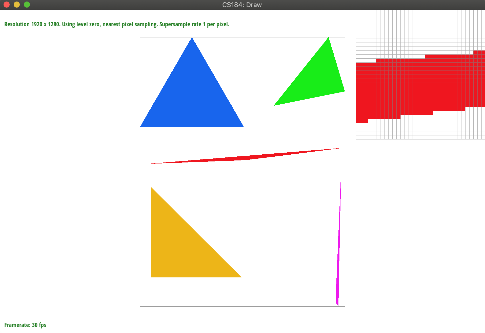
</center><br>
<center>
    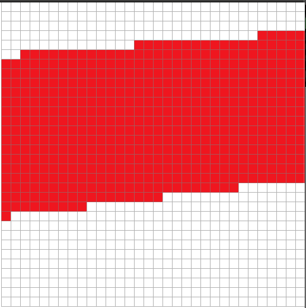
    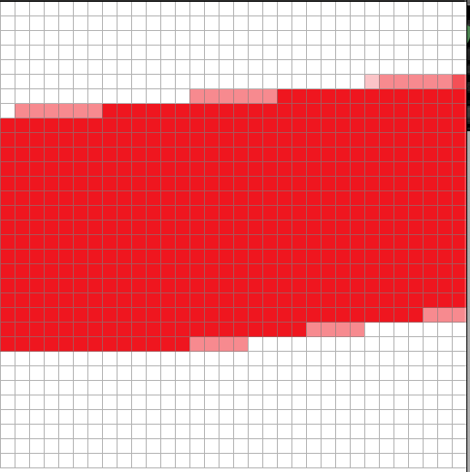
    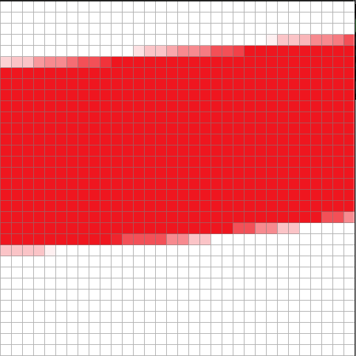
</center><br>

